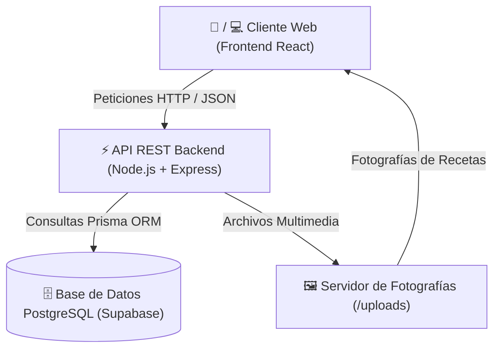
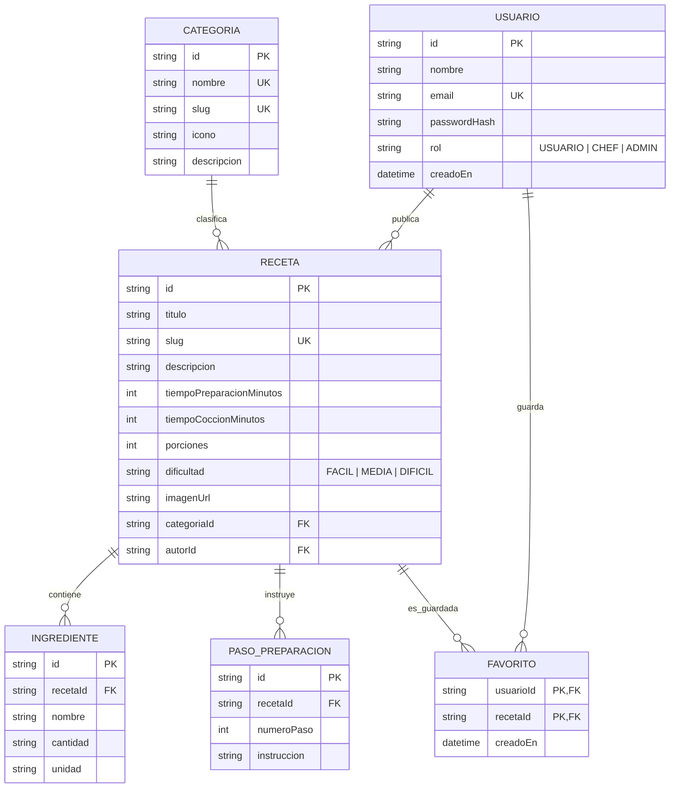

# Documentación del Proyecto: Plataforma Gastronómica RECETARIO

Bienvenido a la documentación oficial del proyecto **RECETARIO**, una plataforma gastronómica web moderna, interactiva y responsiva diseñada para explorar, calcular porciones, guardar favoritos y moderar recetas de cocina.

---

## 1. Visión General del Proyecto

**RECETARIO** nace con el propósito de conectar a amantes de la cocina (comensales, afines y chefs) a través de una experiencia digital intuitiva, atractiva y funcional.

### ¿Qué resuelve la plataforma?
- **Adaptación Didáctica de Porciones:** Ajusta automáticamente la cantidad exacta de ingredientes según el número de comensales mediante cálculos proporcionales.
- **Búsqueda y Filtrado Inteligente:** Permite encontrar platillos combinando múltiples categorías (Desayunos, Cenas, Postres, etc.), niveles de dificultad y tiempo máximo de preparación.
- **Organización Personalizada:** Permite a los usuarios registrados guardar sus platillos preferidos en su colección de **Favoritos**.
- **Moderación y Control de Calidad:** Cuenta con un panel de control exclusivo donde los Administradores gestionan categorías, aprueban contenido y administran permisos.

---

## 2. Arquitectura del Sistema (Frontend & Backend)

La aplicación está construida bajo una **arquitectura desacoplada** compuesta por dos capas principales que se comunican entre sí mediante una **API REST (JSON)** sobre HTTP/HTTPS:

### 🎨 Frontend (Interfaz de Usuario)
- **Tecnología:** React + TypeScript + Vite + Vanilla CSS.
- **Diseño Mobile-First:** Diseñado para adaptarse fluidamente a cualquier pantalla (teléfonos móviles, tabletas y computadoras de escritorio).
- **Estética Gourmet:** Uso de paletas de colores cálidas, gradientes suaves, animaciones fluidas e iconos vectoriales semánticos (`lucide-react`).
- **Resiliencia de Red:** Si una imagen falla o el backend tarda en despertar, el frontend muestra indicadores amigables ("Despertando servidor...") o imágenes de respaldo (*fallback*).

### ⚙️ Backend (Servidor de Datos y Lógica)
- **Tecnología:** Node.js + Express + TypeScript + Prisma ORM.
- **Seguridad:** Autenticación mediante **Tokens JWT** y encriptación de contraseñas con **Bcrypt**.
- **Gestión de Archivos:** Carga y procesamiento seguro de imágenes de recetas mediante **Multer**.

---

## 3. Modelo y Diagrama de Base de Datos

La información del sistema se almacena de forma estructurada e íntegra en **PostgreSQL**. A continuación se presenta el modelo relacional:

### Explicación Sencilla de las Tablas:
1. **Usuarios (`usuarios`):** Almacena los datos de los usuarios registrados, su contraseña cifrada y su **rol de acceso**.
2. **Categorías (`categorias`):** Almacena las secciones gastronómicas (ej. *Desayunos, Almuerzos, Cenas, Postres, Bebidas*).
3. **Recetas (`recetas`):** Guarda los datos principales del platillo (título, descripción, porciones base, tiempos y fotografía).
4. **Ingredientes (`ingredientes`):** Lista detallada de insumos necesarios (nombre, cantidad base y unidad de medida).
5. **Pasos de Preparación (`pasos_preparacion`):** Instrucciones ordenadas paso a paso para elaborar el platillo.
6. **Favoritos (`favoritos`):** Tabla de enlace que registra las recetas que cada usuario ha guardado en su lista personal.

---

## 4. Gestión de Roles y Permisos (RBAC)

La plataforma aplica un **Control de Acceso Basado en Roles (RBAC)** para garantizar la seguridad y privacidad:

| Rol | Ícono / Badge | Permisos en la Plataforma |
| :--- | :---: | :--- |
| **`USUARIO`** *(Comensal / Lector)* | 👤 Usuario | • Explorar el catálogo completo de recetas. • Usar la calculadora didáctica de porciones. • Guardar y quitar recetas en su lista de **Favoritos**. • Cambiar tema Claro / Oscuro. |
| **`CHEF`** *(Creador de Contenido)* | 🍳 Chef | • Todo lo anterior. • Publicar nuevas recetas con fotografía, ingredientes y pasos. • Editar o eliminar únicamente las recetas creadas por él mismo. |
| **`ADMIN`** *(Administrador)* | 🛡️ Admin | • Acceso exclusivo al **Panel de Administración**. • **Moderación Global:** Eliminar cualquier receta inapropiada. • **Gestión de Categorías:** Crear, editar o borrar categorías gastronómicas en vivo. • **Gestión de Usuarios:** Asignar o cambiar el rol de cualquier usuario (`USUARIO`, `CHEF`, `ADMIN`). |

---

## 5. Funcionalidades Destacadas

### A. Calculadora Didáctica Proporcional de Porciones
Cuando un usuario desea preparar una receta para más o menos personas de las que indica la receta original, el sistema aplica una **Regla de Tres Simple Proporcional**:

$$\text{Cantidad Ajustada} = \frac{\text{Cantidad Base} \times \text{Porciones Deseadas}}{\text{Porciones Base}}$$

- **Factor de Cambio:** Se muestra un indicador visual (ej: `2.0x Proporcional`) para orientar al cocinero.
- **Ingredientes Interactivos:** El usuario puede tocar cada ingrediente o paso para marcarlo como completado durante la cocina.

### B. Panel de Administración Modular
El panel de control (`AdminPanel`) está organizado en tres pestañas interactivas:
1. **Moderación de Recetas:** Vista previa rápida y borrado seguro con diálogo de confirmación.
2. **Gestión de Categorías:** Formulario para registrar nuevas categorías o corregir las existentes.
3. **Usuarios y Roles:** Tabla de usuarios con un selector directo para promover o cambiar el rol de los miembros.

---

## 6. Despliegue en la Nube y Resiliencia

- **Frontend:** Desplegado en **Vercel**, aprovechando su CDN global para tiempos de carga ultrarrápidos.
- **Backend:** Desplegado en **Render**, conectado a una base de datos **PostgreSQL en Supabase**.
- **Manejo de Reenganche (Cold Start):** Como el servidor en la nube entra en reposo tras periodos de inactividad, la interfaz muestra un aviso informativo de encendido automático y reintenta las solicitudes de forma transparente.
- **Resiliencia de Imágenes:** Si una imagen subida expira o no se encuentra, el sistema la sustituye automáticamente por una imagen gastronómica de respaldo de alta calidad (*fallback*), evitando iconos rotos en la pantalla.
